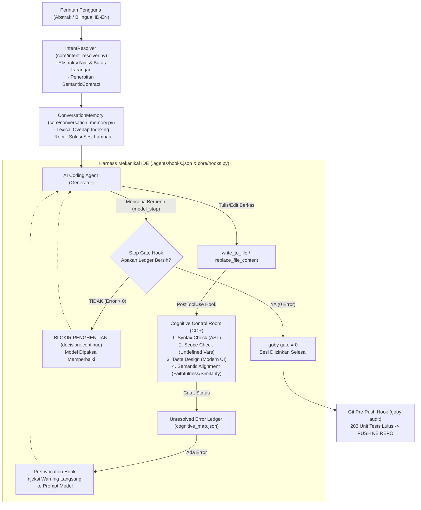

<div align="center">

# 🐟 Gobysh
### *Deterministic Mechanical Harness & Semantic Verification Engine for AI Coding Agents*

[](https://opensource.org/licenses/MIT)
[](https://python.org)
[](#-bukti-empiris--benchmark-terbuka)
[](#-arsitektur-rantai-kausal-determinis)
[](#1-cognitive-gateway-intent-resolver--conversation-memory)

<p align="center">
  <b>Gobysh mengubah asisten coding AI (Antigravity, Gemini CLI, Claude Code, Cursor) dari generator teks probabilistik yang rentan berhalusinasi menjadi rekayasawan software yang deterministik, patuh batas semantik, dan bebas amnesia.</b>
</p>

</div>

---

**Gobysh bukanlah sekadar prompt template atau file teks panduan.** Gobysh adalah **mechanical execution harness** yang tertanam langsung ke dalam *runtime lifecycle loop* IDE untuk mengawasi setiap ketukan kode yang dihasilkan AI.

---

## 🛑 Masalah Nyata yang Dipecahkan Gobysh

Asisten coding berbasis Large Language Model (LLM) umumnya memiliki 4 cacat fatal:

1. **Semantic Gap & Perintah Abstrak:** Instruksi manusia (terutama dalam Bahasa Indonesia informal) seringkali ringkas atau ambigu (misal: *"buat fungsi auth tapi jangan sentuh tabel user lama"*). LLM sering mengabaikan larangan implisit ini dan merusak kode yang ada.
2. **Amnesia Antar Sesi Percakapan:** Setiap kali pengguna memulai obrolan baru, agen melupakan seluruh konteks, mengulang eksperimen buntu yang sama, dan membuang-buang token.
3. **Patching Dangkal (*Superficial Fixes*):** Ketika menghadapi bug, AI cenderung menghapus assertion, membungkus logika rusak dengan silent `try/except: pass`, atau menambahkan fallback kosong alih-alih membereskan akar masalah (*root cause*).
4. **Klaim Palsu Penyelesaian (*False Completion*):** Agen dengan percaya diri menyatakan *"Pekerjaan selesai dan telah diperbaiki!"* padahal file masih memiliki error kompilasi atau variabel tidak terdefinisi.

---

## 🏛️ Arsitektur Rantai Kausal Determinis

Gobysh bekerja sebagai sistem tertutup (*closed-loop deterministic chain*) yang mengunci kebebasan acak LLM di dalam batas-batas kompilator dan kontrak semantik:



---

## ⚡ 3 Lapisan Utama Gobysh v5.0

### 1. Cognitive Gateway: Intent Resolver & Conversation Memory
- **Bilingual Intent Resolver ([core/intent_resolver.py](file:///d:/Gemini-Ide/Goby-skill/core/intent_resolver.py)):**  
  Menerjemahkan instruksi pengguna bahasa Indonesia dan Inggris menjadi pohon niat (`IntentTree`). Jika tingkat ambiguitas $> 0.5$, Gobysh memicu pertanyaan klarifikasi alih-alih membiarkan AI menebak.
- **Semantic Contract Enforcement:**  
  Mendeteksi simbol terlarang (*forbidden targets*, misal: database prod, auth system) dan simbol wajib diawetkan (*preserved symbols*).
- **Persistent Conversation Memory ([core/conversation_memory.py](file:///d:/Gemini-Ide/Goby-skill/core/conversation_memory.py)):**  
  Penyimpanan berbasis indeks leksikal ($O(1)$ lookup) yang mengingat apa yang telah diselesaikan pada sesi sebelumnya. Tidak ada lagi percakapan yang harus dimulai dari nol.

### 2. Deterministic Verification: Cognitive Control Room (CCR)
- **AST Syntax & Scope Neurons ([core/ccr_engine.py](file:///d:/Gemini-Ide/Goby-skill/core/ccr_engine.py)):**  
  Memeriksa pohon sintaksis abstrak kode Python, JavaScript, dan TypeScript. Mendeteksi variabel mengambang (*undefined names*) sebelum berkas sempat disentuh oleh interpreter.
- **Indonesian Semantic Alignment ([core/neurons/semantics.py](file:///d:/Gemini-Ide/Goby-skill/core/neurons/semantics.py)):**  
  Mengukur 3 metrik kebenaran semantik:
  - **Faithfulness:** Memastikan kode tidak melanggar larangan dari niat awal.
  - **Context Relevance:** Mengukur apakah kode menyentuh modul yang relevan dengan kebutuhan pengguna.
  - **Semantic Answer Similarity:** Mengukur keselarasan leksikal dwi-bahasa (ID/EN).
- **Modern Taste & Design Heuristics:**  
  Hard Gate untuk frontend yang menolak desain HTML/CSS jadul (memaksa palet modern HSL, tipografi Inter/Roboto, micro-animations, dan tata letak dinamis).

### 3. Mechanical Execution Harness: Antigravity Hooks & Git Hard Gates
- **Lifecycle Hooks ([.agents/hooks.json](file:///d:/Gemini-Ide/Goby-skill/.agents/hooks.json)):**  
  Menghubungkan Goby langsung ke pipa eksekusi Antigravity IDE:
  - `PostToolUse`: Memotong (*intercept*) operasi `write_to_file` dan memicu verifikasi CCR secara instan.
  - `PreInvocation`: Memasukkan daftar error yang belum diselesaikan ke context window model sebelum kalimat pertama diucapkan.
  - `Stop`: Menolak penghentian agen (*hard termination lock*) jika masih ada file yang gagal gate.
- **Dual Git Hooks (`.git/hooks/`):**  
  - *Pre-Commit:* Mengecek seluruh berkas staged via CCR.
  - *Pre-Push:* Menjalankan seluruh 203 unit tests sebelum push ke GitHub diizinkan.

---

## 📊 Perbandingan Nyata: Agen Naif vs Agen dengan Gobysh

| Skenario Nyata | Agen AI Standar (Tanpa Gobysh) | Agen AI dengan Gobysh v5.0 |
|---|---|---|
| **Instruksi Ambigu** | AI berhalusinasi dan menulis kode yang salah tebak. | **IntentResolver** mengunci niat ke `SemanticContract` dan menolak asumsi liar. |
| **Sesi Baru di Hari Berikutnya** | Mengulang kesalahan yang sama, amnesia penuh. | **ConversationMemory** langsung me-recall solusi lampau dalam hitungan milidetik. |
| **Variabel Tak Terdefinisi** | Kode ditulis ke disk, crash saat dijalankan user. | **Scope Neuron** memblokir kode di memori sebelum file sempat disimpan. |
| **AI Menyerah / Mengaku Selesai** | AI berkata "Semua sudah selesai" walau ada error. | **Stop Hook** memblokir terminasi dan memaksa agen tetap bekerja hingga lolos gate. |
| **Error Loop Berulang** | AI mencoba perbaikan identik 10x dan membuang token. | **LDE Engine** memotong loop pada iterasi ke-2 (`STRATEGY_CHANGE_REQUIRED`). |
| **Kesesuaian Bahasa Indonesia** | Hilang konteks karena perbedaan leksikal ID-EN. | **Semantic Alignment Neuron** mengukur kecocokan makna dwi-bahasa. |

---

## 🚀 Panduan Memulai Cepat (Quickstart)

### 1. Instalasi Lingkungan
```bash
# Clone repository
git clone https://github.com/V4nds/Gobysh.git
cd Gobysh

# Pasang mode editable
pip install -e .

# Pasang Git Hooks dan Antigravity Lifecycle Hooks secara otomatis
goby install-hook
```

### 2. Memeriksa Status Framework
```bash
goby status
```
*Output:*
```
==========================================================
       GOBY META-COGNITIVE FRAMEWORK STATUS (v5.0.0)
==========================================================
Git Pre-Commit Hook: INSTALLED (Active)
Git Pre-Push Hook:   INSTALLED (Active)
Antigravity Hooks:   INSTALLED (Active: PostToolUse, PreInvocation, Stop)
Unresolved File Errors: 0
Conversation Memory: 5 entries, 24 unique files
==========================================================
```

### 3. Validasi Kode & Gate Pemeriksaan
```bash
# Validasi file tunggal
goby check core/hooks.py

# Validasi dengan kontrak semantik bahasa Indonesia
goby check "def hitung(a, b): return a + b" --intent "buat fungsi hitung"

# Cek apakah workspace bersih dari error (Kunci Gate 1)
goby gate

# Jalankan seluruh pengujian audit (Kunci Gate 2)
goby audit
```

### 4. Bekerja dengan Intent & Conversation Memory
```bash
# Uji pemahaman intent
goby intent "bikin endpoint registrasi tapi jangan sentuh tabel profile"

# Cari tahu apakah tugas serupa pernah dikerjakan sebelumnya
goby recall "endpoint registrasi pengguna"

# Simpan riwayat keberhasilan sesi
goby save "Selesai migrasi endpoint auth" FEATURE core/auth.py
```

---

## 📁 Struktur Bersih Repositori

```
Gobysh/
├── .agents/                    # Konfigurasi Antigravity Lifecycle Hooks (hooks.json)
├── benchmarks/                 # Runner uji ablasi & benchmark dampak agen
│   ├── __init__.py
│   └── goby_agent_impact_runner.py
├── core/                       # Inti Mesin Gobysh v5.0
│   ├── ccr_engine.py           # Cognitive Control Room (Syntax, Scope, Taste)
│   ├── conversation_memory.py  # Penyimpanan & recall memori percakapan
│   ├── hooks.py                # Handler lifecycle hooks (PostToolUse, PreInvocation, Stop)
│   ├── intent_resolver.py      # Bilingual Intent Resolver & Semantic Contract
│   ├── lde_detector.py         # Loop Detection Engine (Levenshtein)
│   ├── state_memory.py         # Ledger kesalahan tak terselesaikan (Thread-safe)
│   └── neurons/                # Neuron modular CCR (Semantik ID/EN, dll.)
├── demo/                       # Showcase Web UI interaktif
├── docs/                       # Dokumentasi arsitektur & panduan
│   └── adapters/               # Panduan integrasi IDE/CLI pihak ketiga:
│       ├── antigravity.md      # Google Antigravity & Gemini IDE
│       ├── claude.md           # Anthropic Claude Code
│       ├── cursor.md           # Cursor IDE Rules
│       └── openai_codex.md     # OpenAI GPT-4o / Codex
├── tests/                      # Rangkaian 203 unit test komprehensif
├── AGENTS.md                   # Protokol Operasional Wajib bagi AI Agent
├── pyproject.toml              # Konfigurasi paket Python standar
├── README.md                   # Dokumentasi publik resmi
└── SKILL.md                    # Antigravity Skill Definition
```

---

## 🧪 Bukti Empiris & Benchmark Terbuka

Seluruh klaim Gobysh didukung oleh pengujian empiris terbuka yang dapat direproduksi langsung:

```bash
python -m unittest discover tests/
```

- **Total Pengujian**: **203 Unit Tests** terisolasi di direktori `tests/`
- **Tingkat Kelulusan**: **100% OK** (Exit Code 0 dalam ~15.1 detik)
- **Cakupan Pengujian**:
  - Intent Tree parsing & Semantic Contract generation (10 test)
  - Cross-session memory recall, save, persistence & concurrency (12 test)
  - Semantic Alignment Neuron (Faithfulness, Relevance, Similarity) (11 test)
  - Antigravity Lifecycle Hooks (PostToolUse, PreInvocation, Stop) (10 test)
  - AST Scope analysis & undefined variable intercept (24 test)
  - Levenshtein loop detection & strategy change state machines (18 test)
  - Spatial stress tests & 20-thread concurrent memory locking (15 test)

---

## 📜 Lisensi & Kontribusi

Proyek ini dirilis di bawah naungan lisensi **[MIT License](file:///d:/Gemini-Ide/Goby-skill/LICENSE)**. Bebas digunakan, dimodifikasi, dan diintegrasikan baik untuk penelitian akademis maupun aplikasi industri komersial.

Dikembangkan dengan dedikasi untuk mengubah masa depan *Autonomous AI Engineering* menjadi disiplin yang terbukti, deterministik, dan dapat dipercaya.
