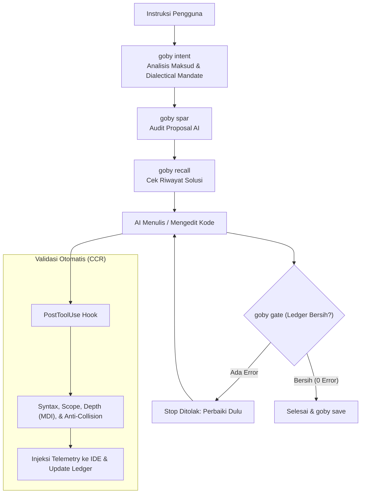

<div align="center">

# 🐟 Gobysh
### *Context Manager & Guardrail Framework untuk AI Coding Agent*

[](https://opensource.org/licenses/MIT)
[](https://python.org)
[](#-pengujian)
[](#-perintah-cli)

<p align="center">
  Gobysh adalah kerangka kerja pengaman (guardrail) dan pengelola konteks untuk AI coding agent (Antigravity IDE, Claude Code, Cursor, dll). Memastikan AI memahami instruksi secara akurat, tidak membuat duplikasi fitur, menjaga kedalaman arsitektur kode, dan tidak berhenti sebelum semua verifikasi lolos.
</p>

</div>

---

## ⚡ Fitur Utama

- **Intent & Proposal Audit (`goby intent`, `goby spar`)**  
  Menganalisis instruksi sebelum koding dimulai dan menguji rancangan AI terhadap risiko serta trade-off nyata agar AI tidak bersikap *yes-man*.
- **Architectural Depth Engine (`goby deepen`)**  
  Menganalisis rasio implementasi terhadap antarmuka (Module Depth Index / MDI berdasarkan prinsip Ousterhout). Modul pembungkus dangkal (*shallow pass-through wrapper*) otomatis diblokir via *Conditional Hard Gate*.
- **Anti-Collision & Visual Density**  
  Mendeteksi komponen agar kontrol tidak terduplikasi di tempat lain, serta mencegah pembungkusan tampilan secara berlebihan (*anti-boxification*).
- **Lifecycle Hooks & Aggressive Telemetry**  
  Tersambung langsung ke IDE via `.agents/hooks.json`. Memberikan telemetri MDI real-time pada setiap perubahan file dan memblokir agent keluar jika masih ada error di ledger.
- **Memory Lintas Sesi (`goby recall`, `goby save`)**  
  Menyimpan solusi yang berhasil agar sesi berikutnya dapat langsung melanjutkan tanpa mengulang eksplorasi dari awal.

---

## 🛠️ Alur Kerja



---

## 🚀 Instalasi & Penggunaan

### Instalasi
```bash
git clone https://github.com/V4nds/Gobysh.git
cd Gobysh
pip install -e .
goby install-hook
```

### Perintah CLI
```bash
# Cek status instalasi dan memori
goby status

# Analisis maksud instruksi pengguna
goby intent "buat tombol pengukuran sudut di canvas"

# Uji proposal/rencana kerja AI
goby spar "gunakan wrapper class sederhana" --intent "buat handler event"

# Cek kedalaman arsitektur kode (tambah --report untuk HTML visual)
goby deepen core/

# Validasi file kode sebelum commit
goby check core/ccr_engine.py

# Cek apakah masih ada error yang belum selesai (Gate 1)
goby gate

# Jalankan seluruh unit test (Gate 2)
goby audit

# Cari solusi dari sesi sebelumnya
goby recall "pengukuran sudut"

# Simpan konteks sesi yang sudah selesai
goby save "Fitur pengukuran sudut selesai" create_feature src/canvas.js
```

---

## 📁 Struktur Proyek

```
Gobysh/
├── .agents/                    # Konfigurasi lifecycle hooks Antigravity (hooks.json)
├── core/                       # Inti framework
│   ├── ccr_engine.py           # Cognitive Control Room & evaluator gate
│   ├── cli.py                  # Antarmuka CLI goby
│   ├── conversation_memory.py  # Penyimpanan & recall memori percakapan
│   ├── hooks.py                # Handler lifecycle hooks IDE
│   ├── intent_resolver.py      # Intent parsing & proposal audit
│   ├── taste_synthesis.py      # Evaluator visual density & layout
│   └── semantics/              # Analisis semantik & arsitektur
│       ├── depth_engine.py     # Analisis kedalaman AST & MDI
│       ├── capability_registry.py # Anti-collision kontrol
│       ├── specification.py    # Kontrak spesifikasi & dialectical
│       └── constraints.py      # Deteksi kontradiksi
├── tests/                      # Rangkaian unit test (257 tests)
├── AGENTS.md                   # Panduan operasional AI agent
├── pyproject.toml              # Konfigurasi package Python
└── README.md                   # Dokumentasi
```

---

## 🧪 Pengujian

Jalankan seluruh test suite bawaan:

```bash
python -m unittest discover tests/
```

- **Status**: 257/257 unit tests passed (100% OK).

---

## 📜 Lisensi

[MIT License](LICENSE)
