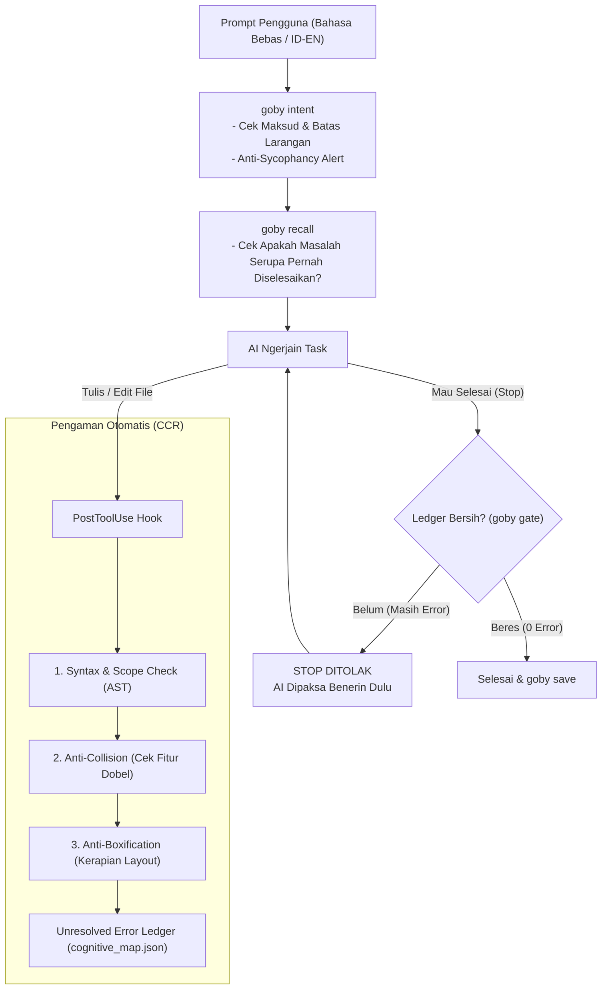

<div align="center">

# 🐟 Gobysh
### *Context Manager & Guardrail Framework buat AI Coding Agent*

[](https://opensource.org/licenses/MIT)
[](https://python.org)
[](#-unit-tests--bukti-empiris)
[](#-gimana-cara-kerjanya)
[](#1-intent-resolver--anti-sycophancy-dialectical-sparring)

<p align="center">
  <b>Gobysh nemenin AI coding agent (Antigravity, Gemini CLI, Claude Code, Cursor, dll) sebagai pengaman (guardrail) dan manajer konteks. Fokusnya ngasih kerangka kerja yang rapi biar AI nggak halusinasi, nggak bikin fitur duplikat, dan nggak asal klaim "sudah selesai".</b>
</p>

</div>

---

## 🎯 Masalah yang Sering Muncul & Diselesaikan Gobysh

Kalau kamu sering pakai AI buat ngoding, kemungkinan besar pernah ngalamin hal-hal ini:

1. **AI Jadi 'Yes-Man' (Sycophancy):** Setiap kali kita lempar ide atau rancangan, AI langsung memuji dan mengiyakan tanpa mikir efek sampingnya. Ujung-ujungnya solusinya klise atau malah bikin masalah baru.
2. **Double Fitur yang Bocor:** Fitur yang sama (misal tombol pengukuran sudut, slider, atau tombol reset) dibuat lagi di tempat lain karena AI nggak sadar kontrol itu udah ada di komponen sebelah.
3. **Gaya Kaku & Boxification:** Semua angka, simbol, dan teks penjelasan dipaksa masuk ke dalam kartu/kotak (bento-box klise), bikin tampilan UI jadi sempit dan kaku.
4. **Klaim Palsu Selesai:** AI dengan santai bilang *"Pekerjaan selesai!"*, padahal kodenya masih ada variabel nyasar (*undefined*), sintaks patah, atau tes belum jalan.
5. **Amnesia Antar Obrolan:** Begitu mulai chat/sesi baru, AI lupa apa yang udah dikerjain kemarin dan ngulang eksperimen buntu yang sama.

---

## ⚡ Fitur Utama Gobysh (v5.2)

### 1. Intent Resolver & Anti-Sycophancy (Dialectical Sparring)
- Sebelum mulai nulis kode, Goby membedah maksud instruksi kamu lewat `goby intent`.
- **Nggak Asal Manggut:** Pada fase perencanaan atau arsitektur, Goby ngingetin AI buat nggak jadi *yes-man*. AI wajib menyajikan catatan trade-off, blindspot, dan alternatif solusi yang lebih efisien sebelum buru-buru eksekusi.

### 2. Anti-Collision (ComponentCapabilityRegistry)
- Goby nyatet kapabilitas kontrol yang udah terpasang di tiap komponen proyek ([core/semantics/capability_registry.py](file:///d:/Gemini-Ide/Goby-skill/core/semantics/capability_registry.py)).
- Kalau AI mau bikin tombol atau aksi serupa di komponen lain, Goby bakal ngasih tahu: *"Fitur ini udah ada di Toolbar, jangan diduplikasi lagi di Sidebar."*

### 3. Anti-Boxification & Visual Density Governor
- Goby nggak lagi maksa kamu harus pakai keyword bento, glass, atau 3D tertentu ([core/taste_synthesis.py](file:///d:/Gemini-Ide/Goby-skill/core/taste_synthesis.py)).
- Yang dijaga adalah kerapian layout: mencegah teks/simbol sepele dibungkus berlapis-lapis card/box. Layout CSS native yang bersih, semantic HTML (`<output>`, `<meter>`, `<dl>`), dan HUD kontekstual jauh lebih diutamakan.

### 4. Guardrail Mekanikal & Lifecycle Hooks
- **Syntax & Scope Check:** Cek sintaks (AST) dan variabel undefined di memori sebelum file sempat disimpan ke disk.
- **Stop Hook:** AI dilarang berhenti kalau masih ada error yang tercatat di ledger (`cognitive_map.json`).
- **Memory Lintas Sesi:** `goby recall` dan `goby save` buat nyimpan ringkasan solusi biar sesi berikutnya langsung nyambung tanpa mulai dari nol.

---

## 🛠️ Gimana Cara Kerjanya?

Alur kerja Goby berjalan otomatis di latar belakang:



---

## 🚀 Cara Pakai Cepat

### 1. Pasang & Setup
```bash
# Clone repo
git clone https://github.com/V4nds/Gobysh.git
cd Gobysh

# Pasang mode editable
pip install -e .

# Pasang hooks git dan IDE
goby install-hook
```

### 2. Perintah CLI Sehari-hari
```bash
# Cek kesehatan framework & memori
goby status

# Bedah maksud prompt & cek risiko/trade-off
goby intent "buat tombol pengukuran sudut di canvas"

# Cek kode atau file sebelum commit
goby check core/hooks.py

# Pastikan nggak ada error yang tertinggal (Gate 1)
goby gate

# Jalankan seluruh unit test (Gate 2)
goby audit

# Cari tahu riwayat solusi sebelumnya
goby recall "pengukuran sudut"

# Simpan hasil kerja sesi ini
goby save "Selesai nambahin fitur sudut tanpa duplikasi" create_feature src/canvas.js
```

---

## 📁 Struktur Folder Proyek

```
Gobysh/
├── .agents/                    # Konfigurasi lifecycle hooks Antigravity (hooks.json)
├── core/                       # Mesin utama Goby
│   ├── ccr_engine.py           # Cognitive Control Room (Syntax, Scope, Taste)
│   ├── conversation_memory.py  # Penyimpanan & recall memori percakapan
│   ├── hooks.py                # Handler lifecycle hooks (PostToolUse, PreInvocation, Stop)
│   ├── intent_resolver.py      # Intent Resolver & Dialectical Sparring
│   ├── taste_synthesis.py      # VisualDensityGovernor & Anti-Boxification
│   ├── semantics/              # Lapisan semantik & kontrak
│   │   ├── capability_registry.py # Anti-Collision Engine (Pencegah Fitur Dobel)
│   │   ├── specification.py    # Requirement & DialecticalContract models
│   │   ├── constraints.py      # Deteksi kontradiksi & batasan
│   │   ├── intermediate_representation.py # SemanticIR & SemanticEntity
│   │   ├── preservation.py     # Proteksi kode lama
│   │   └── scope.py            # Normalisasi path & boundary
│   └── neurons/                # Neuron modular CCR (Syntax, Scope, Taste)
├── demo/                       # Demo UI interaktif
├── tests/                      # Rangkaian 247 unit test lengkap
├── AGENTS.md                   # SOP wajib bagi AI agent
├── SKILL.md                    # Definisi skill Antigravity
├── pyproject.toml              # Konfigurasi paket Python
└── README.md                   # Dokumentasi ini
```

---

## 🧪 Unit Tests & Bukti Empiris

Semua fungsionalitas diuji langsung lewat unit test bawaan:

```bash
python -m unittest discover tests/
```

- **Total Pengujian**: **247 Unit Tests** (100% PASS dalam ~15 detik).
- **Mencakup**: Dialectical contract, capability collision check, visual density governor, semantic IR, scope check, lifecycle hooks, dan memory persistence.

---

## 📜 Lisensi

Dirilis dengan lisensi **[MIT License](file:///d:/Gemini-Ide/Goby-skill/LICENSE)**. Bebas dipakai, dimodifikasi, dan disesuaikan dengan kebutuhan proyekmu.

