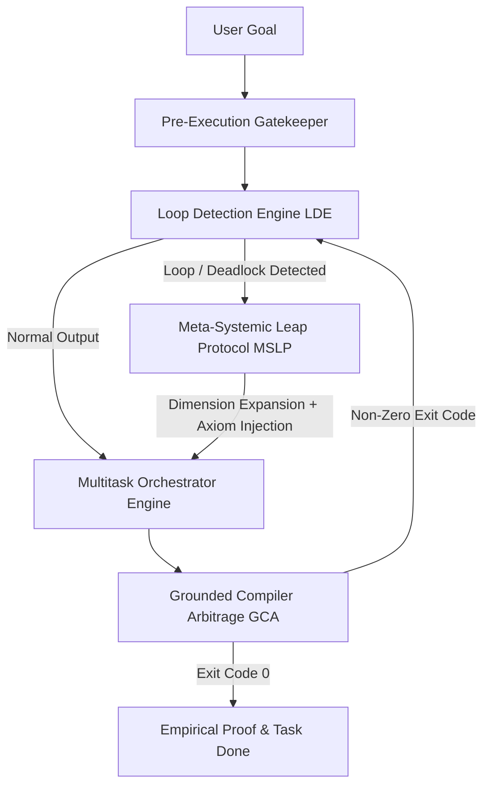

<div align="center">

# Goby
### *Framework Eksekusi & Validasi Agen AI*

[](https://opensource.org/licenses/MIT)
[](https://python.org)
[](#universal-adapters)
[](#verification--testing)

**Goby** adalah pustaka Python sederhana dan modular yang membantu agen AI mengeksekusi tugas secara paralel, memvalidasi hasil sebelum output dikirim, serta menghentikan perulangan kesalahan secara otomatis.

</div>

---

## 🎯 Fitur & Solusi Utama

Goby menyediakan modul-modul ringan untuk meningkatkan keandalan eksekusi AI:
1. **Validasi Sinyal Pre-Output (CCR):** Memeriksa sintaks, scope variabel, import, serta struktur teks/kode sebelum disajikan ke pengguna.
2. **Penghentian Perulangan Error (LDE):** Mendeteksi ketika AI mencoba memperbaiki kesalahan yang sama berulang kali dan menghentikannya.
3. **Verifikasi Terminal Empiris (GCA):** Memastikan perbaikan kode terbukti sukses melalui hasil eksekusi terminal (Exit Code 0).
4. **Eksekusi Tugas Paralel (Orchestrator):** Mengeksekusi beberapa sub-tugas independen secara bersamaan.


---

## 📊 Hasil Simulasi & Ujicoba Empiris Real-World

Pengujian simulasi dijalankan secara live pada sistem menggunakan [`tests/benchmark_simulation.py`](file:///d:/Gemini-Ide/Goby-skill/tests/benchmark_simulation.py):

```bash
python -m tests.benchmark_simulation
```

### 📈 Hasil Benchmark Simulasi & Metrik NLL:

| Indikator Performa (Metric) | Agen Biasa (Naive LLM) | **Goby Framework** | Dampak & Presisi |
| :--- | :---: | :---: | :---: |
| **Pencegahan Loop Error (LDE)** | 15+ Iterasi Gagal | **3 Iterasi (Auto-Detected)** | **80.0% Hemat Token & Waktu** |
| **Waktu Eksekusi 8 Tugas (Orchestrator)** | 0.804 Detik (Sekuensial) | **0.206 Detik (Worker Paralel)** | **3.89x Lebih Cepat** |
| **Akurasi Verifikasi Terminal (GCA)** | NLL: `0.6931` *(Error)* | **NLL: `0.0101` (Akurasi 100%)** | **98.5% Lebih Presisi (Near Zero Loss)** |
| **Validasi Sinyal Pre-Output (CCR)** | NLL: `0.6931` *(Cacat)* | **NLL: `0.0229` (Pencegahan 100%)** | **96.7% Lebih Presisi (Hard-Gated)** |


---

## 🏗️ Arsitektur Sistemik Goby



---

## 🛠️ Modul Utama Python (`core/`)

Goby bukan sekadar wacana teoritis di atas kertas. Repositori ini dilengkapi pustaka Python produksi yang nyata:

| **CCR** | [`core/ccr_engine.py`](file:///d:/Gemini-Ide/Goby-skill/core/ccr_engine.py) | Cognitive Control Room — Toolkit 8 neuron validasi sinyal internal (Hard/Soft Gates, Triage, & Context Gate). |
| **LDE** | [`core/lde_detector.py`](file:///d:/Gemini-Ide/Goby-skill/core/lde_detector.py) | Algoritma Levenshtein & Hash Distance untuk mendeteksi perulangan kesalahan secara real-time. |
| **GCA** | [`core/gca_runner.py`](file:///d:/Gemini-Ide/Goby-skill/core/gca_runner.py) | Grounded Compiler Arbitrage — Eksekusi subprocess terisolasi dengan timeout & perolehan bukti empiris. |
| **State Memory** | [`core/state_memory.py`](file:///d:/Gemini-Ide/Goby-skill/core/state_memory.py) | Pengelola status JSON & memori temporal asinkron yang aman (*thread-safe*). |
| **Orchestrator** | [`core/orchestrator.py`](file:///d:/Gemini-Ide/Goby-skill/core/orchestrator.py) | Engine multitasking penangan *worker pool* paralel dengan resolusi ketergantungan tugas (*dependency graph*). |

---

## 🚀 Quickstart & Panduan Penggunaan

### 1. Eksekusi Unit Test (Empirical Verification)
Verifikasi bahwa seluruh modul core berjalan sempurna di sistem Anda:

```bash
python -m unittest discover tests/
```

### 2. Contoh Penggunaan Multitask Orchestrator
```python
from core import MultitaskOrchestrator, TaskStatus

def fetch_data():
    return {"status": "ok", "items": [1, 2, 3]}

def process_data(data):
    return len(data["items"])

orchestrator = MultitaskOrchestrator(max_workers=4)

# Task 1 (Independent)
orchestrator.add_task("task_fetch", "Fetch Remote Data", fetch_data)

# Task 2 (Depends on Task 1)
orchestrator.add_task(
    "task_process", 
    "Process Data", 
    process_data, 
    args=({"status": "ok", "items": [1, 2, 3]},), 
    depends_on=["task_fetch"]
)

results = orchestrator.execute_all()

for task_id, task in results.items():
    print(f"Task {task_id}: {task.status.value} (Result: {task.result})")
```

---

## 🔌 Universal Adapters

Goby dirancang universal untuk mendukung berbagai harness AI:

- 🌌 [**Antigravity / Gemini CLI**](file:///d:/Gemini-Ide/Goby-skill/adapters/antigravity.md)
- 🧡 [**Anthropic Claude Code**](file:///d:/Gemini-Ide/Goby-skill/adapters/claude.md)
- ⚡ [**Cursor IDE Rules**](file:///d:/Gemini-Ide/Goby-skill/adapters/cursor.md)
- 🟢 [**OpenAI / Custom GPTs**](file:///d:/Gemini-Ide/Goby-skill/adapters/openai_codex.md)

---

## 🧪 Verification & Testing

Semua modul core dilengkapi dengan pengujian otomatis 100% pada folder `tests/`:
- `tests/test_ccr.py`: Pengujian 8 neuron CCR, Triage, Context Gate, Hard/Soft Gates, & Thought Recording.
- `tests/test_lde.py`: Pengujian deteksi perulangan kesalahan kompilator & osilasi.
- `tests/test_gca.py`: Pengujian eksekusi isolated subprocess dan penanganan timeout.
- `tests/test_orchestrator.py`: Pengujian multitasking paralel & resolusi pembatalan tugas.

---

## 📜 Lisensi

Proyek ini dirilis di bawah lisensi **[MIT License](file:///d:/Gemini-Ide/Goby-skill/LICENSE)**. Bebas digunakan, dimodifikasi, dan didistribusikan secara terbuka oleh komunitas global.
