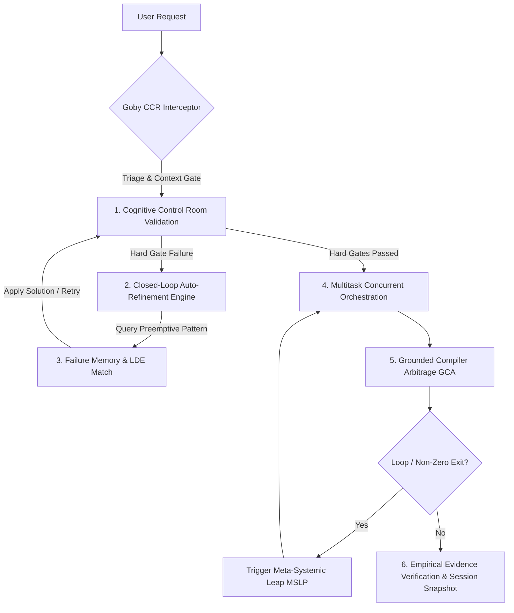

# **Goby (Framework Eksekusi & Validasi Agen AI v1.3.0)**

## 🛡️ **Overview & Filosofi Utama**

Goby adalah pustaka Python modular untuk membantu agen AI mengeksekusi tugas secara paralel, memvalidasi hasil sebelum dikirim, memutus perulangan kesalahan secara otomatis, serta melakukan perbaikan mandiri (*Closed-Loop Auto-Refinement*).

### **Pilar Utama (v1.3.0 Meta-Cognitive Orchestra):**
1. **Cognitive Control Room (CCR):** Validasi sinyal pre-output 9 neurons (Hard Gates untuk Python Syntax, JS/TS Syntax via Node.js, Scope, Import, GCA; Soft Signals untuk Behavior, Density, Reference, & Consistency).
2. **Closed-Loop Auto-Refinement Engine:** Menghubungkan CCR Hard-Gates, LDE Preemptive Pattern Match, dan Failure Memory secara otomatis untuk mencoba perbaikan mandiri.
3. **Loop Detection Engine (LDE & Failure Memory):** Mendeteksi perulangan kesalahan (Levenshtein & Hash) dan menyimpan pola kegagalan lintas-sesi (`failure_patterns.json`) untuk *preemptive resolution*.
4. **Multitask Orchestrator:** Mengeksekusi sub-tugas independen secara paralel dengan *retry policy* (`max_retries`) dan *worker event callbacks*.
5. **Grounded Compiler Arbitrage (GCA) & Output Parsers:** Verifikasi hasil melalui bukti eksekusi terminal (Exit Code 0) dan parser polyglot (pytest, Jest, CLI).
6. **CLI & Package Tooling:** Pustaka terdistribusi (`pyproject.toml`) dengan CLI `goby audit`, `goby benchmark`, dan `goby check <code>`.

---

## 🔄 **Standard Execution Pipeline**

---

## ⚡ **Core Operational Rules**

1. **Evidence Over Assertion:**
   Never declare a task complete or a bug fixed without running a live terminal verification command and demonstrating clean output logs.

2. **Pre-Output Signal Validation (CCR):**
   Run code and text through `CognitiveControlRoom` neurons before output delivery. Hard Gate failures block output programmatically.

3. **Closed-Loop Auto-Refinement:**
   If CCR Hard Gates fail, leverage `CCRRefinementLoop` to search `FailurePatternStore` and attempt code repair before declaring failure.

4. **Multitasking & Balanced Execution:**
   Group independent tasks into concurrent worker batches using `core/orchestrator.py` with retries and progress callbacks.

5. **Self-Healing Loop Breaker:**
   If a compiler or test failure repeats twice with $>85\%$ similarity, invoke `core/lde_detector.py` and execute a **Meta-Systemic Leap**:
   - **Dimension Expansion:** Convert stateless logic to stateful using `core/state_memory.py`.
   - **Axiom Injection:** Inject verified third-party packages or switch from imperative to event-driven paradigms.

---

## 🛠️ **Python Runtime Core Tools**

- **CLI Verification:** `goby audit` or `python -m core.cli audit`
- **CLI Benchmark:** `goby benchmark` or `python -m core.cli benchmark`
- **Cognitive Control Room:** `python -c "from core import CognitiveControlRoom; ccr = CognitiveControlRoom(); print(ccr.neuron_syntax_check('...'))"`
- **Closed-Loop Refinement:** `python -c "from core import CCRRefinementLoop; refiner = CCRRefinementLoop(); print(refiner.run_refinement_cycle('...'))"`
- **Loop Detection:** `python -c "from core import LoopDetectionEngine; ..."`
- **Grounded Arbitrage:** `python -c "from core import GroundedCompilerArbitrage; ..."`
- **Multitask Worker Queue:** `python -c "from core import MultitaskOrchestrator; ..."`
