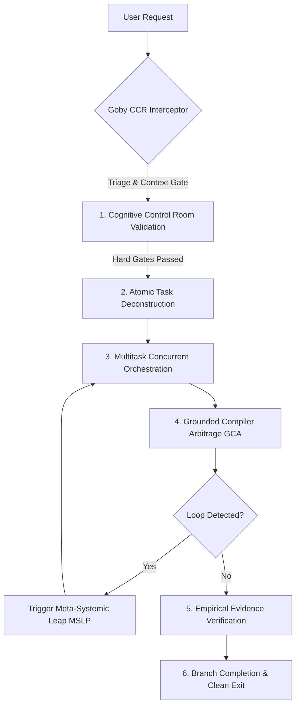

# **Goby (Framework Eksekusi & Validasi Agen AI v1.1.0)**

## 🛡️ **Overview & Filosofi Utama**

Goby adalah pustaka Python modular untuk membantu agen AI mengeksekusi tugas secara paralel, memvalidasi hasil sebelum dikirim, serta memutus perulangan kesalahan secara otomatis.

### **Pilar Utama:**
1. **Cognitive Control Room (CCR):** Validasi sinyal pre-output (Hard Gates untuk Syntax, Scope, Import, GCA; Soft Signals untuk Density & Consistency).
2. **Context Gate & Triage:** Menilai kecukupan konteks dan tingkat review yang diperlukan sebelum memproses tugas.
3. **Loop Detection Engine (LDE):** Mendeteksi dan memutus perulangan kesalahan yang berulang.
4. **Multitask Orchestrator:** Mengeksekusi sub-tugas independen secara paralel.
5. **Grounded Compiler Arbitrage (GCA):** Verifikasi hasil melalui bukti eksekusi terminal (Exit Code 0).

---

## 🔄 **Standard Execution Pipeline**

---

## ⚡ **Core Operational Rules**

1. **Evidence Over Assertion:**
   Never declare a task complete or a bug fixed without running a live terminal verification command and demonstrating clean output logs.

2. **Pre-Output Signal Validation (CCR):**
   Run code and text through `CognitiveControlRoom` neurons before output delivery. Hard Gate failures block output programmatically.

3. **Multitasking & Balanced Execution:**
   Group independent tasks into concurrent worker batches using `core/orchestrator.py`. Ensure dependency chains are resolved before running dependent steps.

4. **Self-Healing Loop Breaker:**
   If a compiler or test failure repeats twice with $>85\%$ similarity, invoke `core/lde_detector.py` and execute a **Meta-Systemic Leap**:
   - **Dimension Expansion:** Convert stateless logic to stateful using `core/state_memory.py`.
   - **Axiom Injection:** Inject verified third-party packages or switch from imperative to event-driven paradigms.

---

## 🛠️ **Python Runtime Core Tools**

- **Cognitive Control Room:** `python -c "from core import CognitiveControlRoom; ccr = CognitiveControlRoom(); print(ccr.neuron_syntax_check('...'))"`
- **Loop Detection:** `python -c "from core import LoopDetectionEngine; ..."`
- **Grounded Arbitrage:** `python -c "from core import GroundedCompilerArbitrage; ..."`
- **Multitask Worker Queue:** `python -c "from core import MultitaskOrchestrator; ..."`

