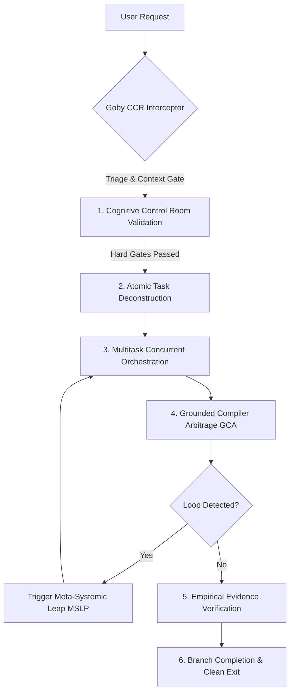

# **Goby (Sistem Penjelajah Batas Gödel - Universal Edition v1.1.0)**

## 🛡️ **Overview & Core Philosophy**

Goby is an open-source, universal meta-cognitive framework designed to elevate AI agent performance beyond static boundaries. It solves the fundamental limitations of Large Language Models: **logic loops**, **compiler deadlock cycles**, **context rot**, **superficial symptom patches**, and **uncalibrated pre-output hallucinations**.

### **Key Pillars:**
1. **Cognitive Control Room (CCR):** Pre-output 8-neuron signal validation (Hard Gates for Syntax/Scope/Imports/GCA, Soft Signals for Density/Consistency/Similarity).
2. **Gatekeeping & Pre-Execution Verification:** Intercepts agent actions *before* any tool call to enforce 4-tier Triage & Context Assessment.
3. **Gödel Boundary Bypass (MSLP Protocol):** Detects loops and expands the state-space via dynamic temporal variables and axiom injection.
4. **Multitask Orchestration:** Executes independent sub-tasks concurrently while maintaining state locking and dependency safety.
5. **Grounded Compiler Arbitrage (GCA):** Prohibits unverified claims; requires empirical terminal proof (Exit Code 0) before declaring completion.

---

## 🔄 **Standard Execution Pipeline**

---

## ⚡ **Core Operational Rules**

1. **Evidence Over Assertion:**
   Never declare a task complete or a bug fixed without running a live terminal verification command and demonstrating clean output logs.

2. **Pre-Output Signal Validation (CCR):**
   Run code and text through `CognitiveControlRoom` neurons before output delivery. Hard Gate failures block output programmatically.

3. **Multitasking & Balanced Execution:**
   Group independent tasks into concurrent worker batches using `core/orchestrator.py`. Ensure dependency chains are resolved before running dependent steps.

4. **Self-Healing Loop Breaker:**
   If a compiler or test failure repeats twice with $>85\%$ similarity, invoke `core/lde_detector.py` and execute a **Meta-Systemic Leap**:
   - **Dimension Expansion:** Convert stateless logic to stateful using `core/state_memory.py`.
   - **Axiom Injection:** Inject verified third-party packages or switch from imperative to event-driven paradigms.

---

## 🛠️ **Python Runtime Core Tools**

- **Cognitive Control Room:** `python -c "from core import CognitiveControlRoom; ccr = CognitiveControlRoom(); print(ccr.neuron_syntax_check('...'))"`
- **Loop Detection:** `python -c "from core import LoopDetectionEngine; ..."`
- **Grounded Arbitrage:** `python -c "from core import GroundedCompilerArbitrage; ..."`
- **Multitask Worker Queue:** `python -c "from core import MultitaskOrchestrator; ..."`

