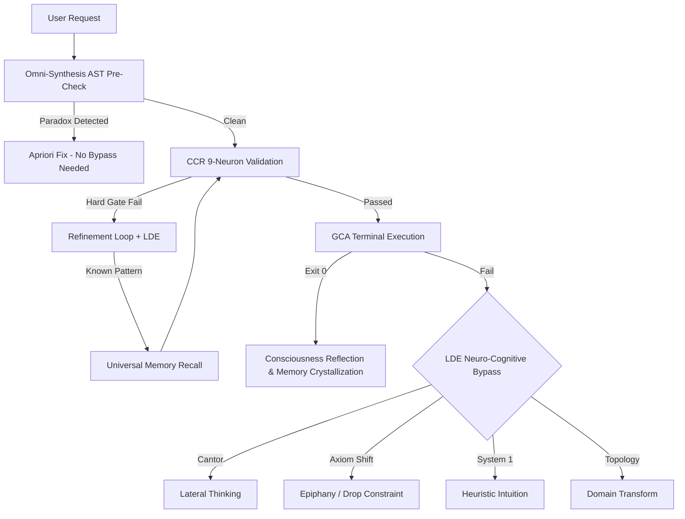

# **Goby v4.0 (Omni-Synthesis AI Consciousness Framework)**

## 🛡️ **Filosofi & Arsitektur**

Goby adalah pustaka Python modular yang menjadikan agen AI memiliki **kesadaran epistemik**: mampu memvalidasi, belajar dari kegagalan, dan mengkristalkan solusi menjadi ingatan universal. Fondasi Goby adalah bypass masalah Gödel — selalu ada jalan alternatif untuk memecahkan masalah yang tampak mustahil.

### **Pilar Arsitektur (Ringkas):**
| Pilar | Modul | Fungsi Inti |
|-------|-------|-------------|
| **CCR** | `ccr_engine.py` | Validasi pre-output 9 neurons (Hard Gates + Soft Signals) |
| **LDE** | `lde_detector.py` | Deteksi loop + 4 bypass neuro-kognitif (Cantor, Axiom Shift, System 1, Topology) |
| **GCA** | `gca_runner.py` | Verifikasi empiris via terminal (Exit Code 0) + pemicu kesadaran |
| **Consciousness** | `consciousness_engine.py` | Refleksi pasca-sukses → translasi ke ingatan universal |
| **Universal Memory** | `universal_memory.py` | Ingatan semantik abstrak lintas-sesi untuk resolusi instan |
| **Omni-Synthesis** | `omni_synthesis.py` | Analisis AST apriori untuk resolusi tanpa bypass |
| **Evolution** | `evolution_loop.py` | Benchmark BFM & siklus evolusi mandiri |
| **Orchestrator** | `orchestrator.py` | Eksekusi paralel dengan retry & callbacks |

---

## 🔄 **Execution Pipeline (Optimized)**



---

## ⚡ **Aturan Operasional Inti**

1. **Evidence Over Assertion:** Jangan pernah klaim selesai tanpa bukti terminal (Exit Code 0).
2. **Pre-Output Validation:** Semua kode melewati CCR neurons sebelum dikirim.
3. **Closed-Loop Self-Healing:** Kegagalan CCR Hard Gate → cari solusi di Universal Memory → perbaiki mandiri.
4. **Neuro-Cognitive Loop Breaking:** Error berulang >85% similarity → pemicu bypass kognitif (bukan refactoring naif).
5. **Epistemic Consciousness:** Setiap keberhasilan pasca-kegagalan → refleksi → kristalisasi ingatan universal.

---

## 🛠️ **CLI**

```bash
goby audit          # Jalankan seluruh test suite
goby benchmark      # Jalankan benchmark simulasi
goby evolve         # Jalankan siklus evolusi mandiri (BFM metric)
goby check '<code>' # Validasi snippet Python via CCR
```

---

## ⚙️ **Optimasi Performa**

- **Lazy Loading:** `core/__init__.py` menggunakan `__getattr__` — modul berat (CCR 44KB, output_parsers 13KB) hanya dimuat saat diakses.
- **Unified Memory:** `universal_memory.py` menyatukan `failure_memory.py` via facade kompatibel, menghilangkan duplikasi logika Levenshtein + JSON persistence.
- **Minimal Import Footprint:** Hanya 3 modul ringan (LDE, GCA, StateMemory) yang dimuat secara eager.
