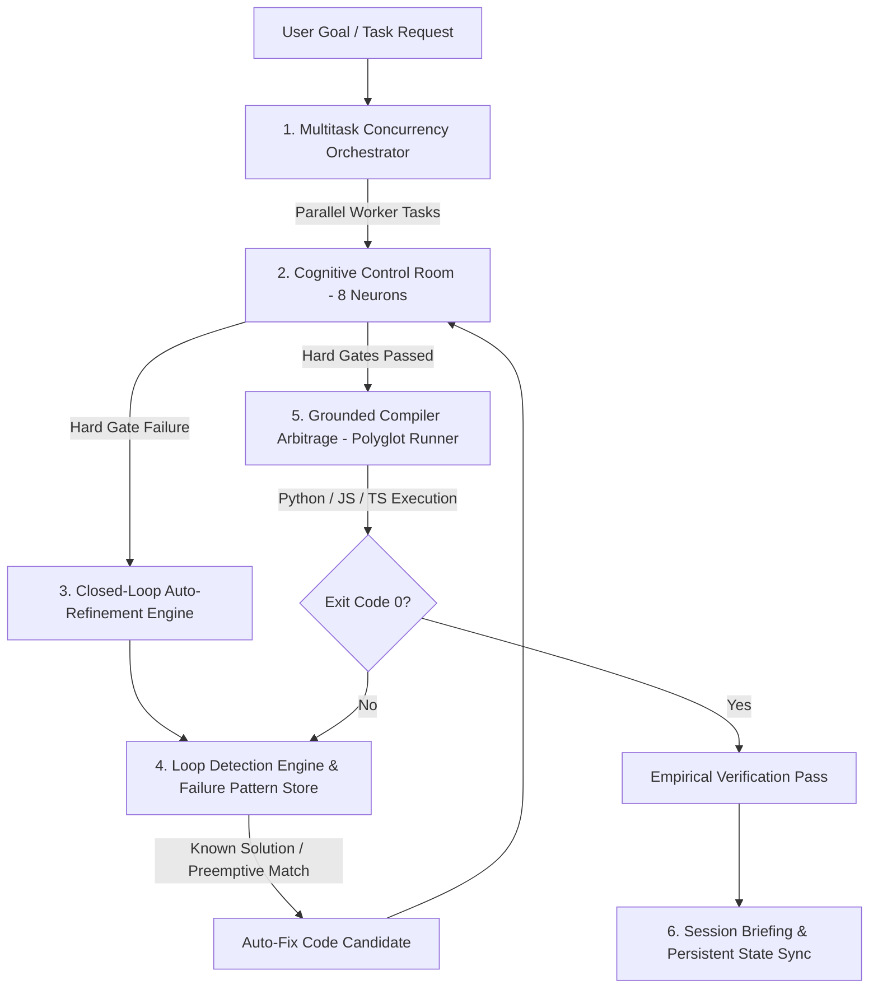

# Goby Meta-Cognitive Orchestra Design Specification (v1.3.0)

**Date:** 2026-07-25  
**Version:** 1.3.0  
**Status:** Approved  
**Author:** Antigravity AI & Goby Core Team  

---

## 🎯 Overview & Vision

Goby is a meta-cognitive execution and validation framework for AI coding agents. 
Version 1.3.0 transforms Goby into a unified, balanced, and resilient **Meta-Cognitive Orchestra**. It connects pre-output validation (CCR), failure memory and loop prevention (LDE), empirical execution proof (GCA), polyglot JS/TS support, and concurrent worker pooling (Orchestrator) into an automated, self-healing loop.

---

## 🏛️ System Architecture & Workflow

---

## 📦 Detailed Component Specifications

### 1. Closed-Loop Auto-Refinement Engine (`core/refinement_loop.py`)
- **Purpose**: Programmatically attempt to self-repair code when CCR Hard Gates (Syntax, Scope, Cross-Ref, GCA) fail.
- **Workflow**:
  1. Receive failed `NeuronSignal`s from `CognitiveControlRoom`.
  2. Query `LoopDetectionEngine.check_preemptive()` and `FailurePatternStore` for known solutions.
  3. Apply structured fixes or hint-guided repairs.
  4. Re-evaluate CCR signals up to `max_attempts` (default: 2).
  5. If unresolved after 2 attempts, trigger `TRIGGER_META_SYSTEMIC_LEAP`.

### 2. Polyglot JS/TS AST Neurons & Parsers (`core/ccr_engine.py` & `core/output_parsers.py`)
- **Purpose**: Deepen polyglot validation for JavaScript/TypeScript environments.
- **Features**:
  - `neuron_js_syntax_check(code)`: Validates JS/TS syntax via Node.js CLI inline evaluation when available.
  - Enhanced TypeScript & ESLint diagnostic parsing in `JestParser` and `GenericParser`.

### 3. Orchestrator Resilience & Worker Hooks (`core/orchestrator.py`)
- **Purpose**: Enhance concurrent task execution with retries, timeline tracking, and callbacks.
- **Features**:
  - Task Retry Policy (`max_retries`, `retry_delay`).
  - Worker Progress & Event Callbacks (`on_task_start`, `on_task_success`, `on_task_failed`).
  - Task execution duration and timeline tracing.

### 4. Distribution Infrastructure & Package Specs (`pyproject.toml`, CLI, GitHub Actions)
- **`pyproject.toml`**: Modern PEP 621 compliant package build configuration.
- **CLI Entrypoint (`core/cli.py`)**: Executable via `goby` or `python -m core.cli` providing subcommands:
  - `goby audit`: Runs full verification and unit test suite.
  - `goby benchmark`: Runs empirical benchmark simulation.
  - `goby check <code>`: Runs CCR neuron validation on code snippet.
- **GitHub Actions Workflow (`.github/workflows/ci.yml`)**: Continuous integration running Python 3.8 - 3.12 test matrix on push/PR.

---

## 🧪 Verification & Acceptance Criteria

1. **Unit Tests**: All existing 87 tests + new tests for `refinement_loop`, `js_syntax_check`, CLI, and orchestrator retries must pass with Exit Code 0.
2. **Benchmark**: `python -m tests.benchmark_simulation` must run cleanly with updated metrics.
3. **CLI Verification**: `python -m core.cli audit` must execute cleanly and return 0.
4. **CI Workflow**: `.github/workflows/ci.yml` must be syntactically valid.

---
